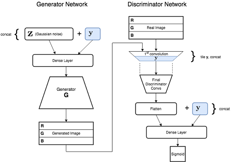

# SNcGAN - Generate Conditional Images
### Spectral Norm + Conditional GAN

**Live demo: [http://adeel.io/sncgan/](http://adeel.io/sncgan/)**

This is a hard fork of [@minhnhat93's](https://github.com/minhnhat93) TensorFlow Spectral Normalization GAN implementation available at: https://github.com/minhnhat93/tf-SNDCGAN. A number of improvements have been made, including the addition of conditioning.

The GAN architecture is depicted here:


In order to train, you will need:
* Python 3.5+
* TensorFlow 
* NumPy
* SciPy 0.19.1
* Pillow

To train, first download CelebA dataset and metadata from [http://mmlab.ie.cuhk.edu.hk/projects/CelebA.html](http://mmlab.ie.cuhk.edu.hk/projects/CelebA.html):
* Unzip **img_align_celeba.zip** to /data/img_align_celeba
* Copy **list_attr_celeba.txt** to /data/img_align_celeba

To train, simply run:
* python train.py

As training progresses, check the output folder for generated samples over time. The first half of the samples grid should be males, and second half females.
 
To test after training is complete, run:
* python generate_images.py

You can edit generate_images.py, and modify the conditioning labels. For example, to get new samples of males, smiling, with black hair and mustaches, set the following flags in generate_images.py:
```python
    sample_y['Male'] = 1
    sample_y['Smiling'] = 1
    sample_y['Black_Hair'] = 1
    sample_y['Blond_Hair'] = 0
    sample_y['Mustache'] = 1
```

Samples will be generated in the output folder, in collage.png.